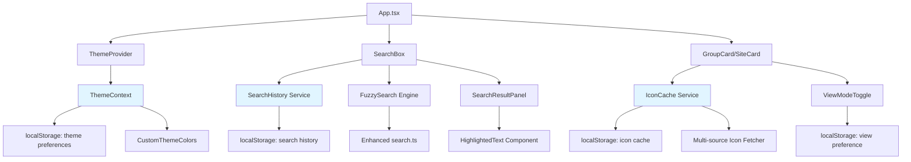
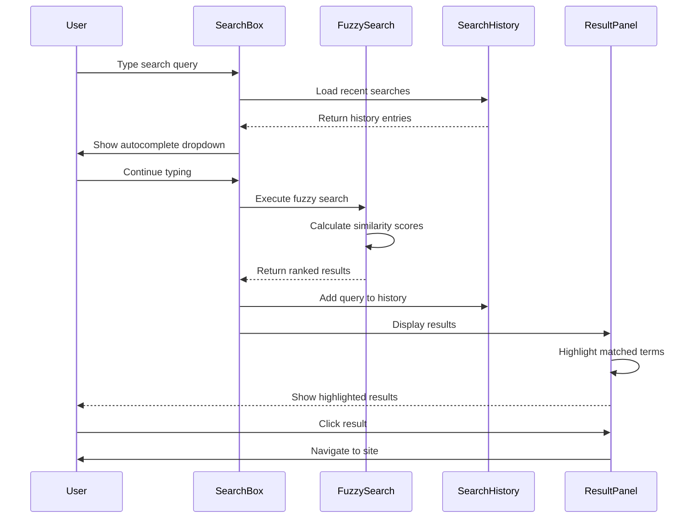

# Design Document: UI and Search Enhancements

## Overview

This feature enhances NaviHive's user experience through two major improvement areas: UI customization (website icon optimization, theme system enhancements, custom color schemes, and view layout options) and search functionality (fuzzy search optimization, search history, and result highlighting). The design leverages the existing React 19 + TypeScript + Material-UI architecture while introducing new components, utilities, and database schema changes to support persistent user preferences and improved search capabilities.

## Architecture



## Components and Interfaces

### Component 1: Enhanced ThemeProvider

**Purpose**: Manages theme state with support for dark/light modes and custom color schemes

**Interface**:
```typescript
interface ThemeContextValue {
  mode: 'light' | 'dark';
  toggleMode: () => void;
  customColors: CustomThemeColors | null;
  setCustomColors: (colors: CustomThemeColors | null) => void;
  resetToDefault: () => void;
}

interface CustomThemeColors {
  primary: string;
  secondary: string;
  background: string;
  surface: string;
  text: string;
}

// Hook for consuming theme context
function useTheme(): ThemeContextValue;
```

**Responsibilities**:
- Persist theme mode to localStorage
- Manage custom color schemes
- Provide theme context to all components
- Generate Material-UI theme object from custom colors

### Component 2: ThemeCustomizer

**Purpose**: UI component for customizing theme colors

**Interface**:
```typescript
interface ThemeCustomizerProps {
  open: boolean;
  onClose: () => void;
}

function ThemeCustomizer(props: ThemeCustomizerProps): JSX.Element;
```

**Responsibilities**:
- Display color pickers for each theme color
- Preview theme changes in real-time
- Save/reset custom theme colors
- Provide preset color schemes

### Component 3: IconCacheService

**Purpose**: Optimized icon fetching with multi-source fallback and caching

**Interface**:
```typescript
interface IconCacheEntry {
  url: string;
  timestamp: number;
  source: 'google' | 'duckduckgo' | 'clearbit' | 'custom';
}

interface IconCacheService {
  getIcon(domain: string, customUrl?: string): Promise<string>;
  clearCache(): void;
  getCacheStats(): { size: number; entries: number };
}

function createIconCacheService(): IconCacheService;
```

**Responsibilities**:
- Try multiple icon sources in priority order
- Cache successful icon URLs in localStorage
- Implement cache expiration (7 days default)
- Handle icon fetch failures gracefully

### Component 4: ViewModeToggle

**Purpose**: Toggle between card and list view layouts

**Interface**:
```typescript
type ViewMode = 'card' | 'list';

interface ViewModeToggleProps {
  mode: ViewMode;
  onChange: (mode: ViewMode) => void;
}

function ViewModeToggle(props: ViewModeToggleProps): JSX.Element;
```

**Responsibilities**:
- Display toggle buttons for card/list views
- Persist view preference to localStorage
- Trigger layout re-render on change

### Component 5: SearchHistoryService

**Purpose**: Manage search history with persistence

**Interface**:
```typescript
interface SearchHistoryEntry {
  query: string;
  timestamp: number;
  resultCount: number;
}

interface SearchHistoryService {
  addEntry(query: string, resultCount: number): void;
  getHistory(limit?: number): SearchHistoryEntry[];
  clearHistory(): void;
  removeEntry(query: string): void;
}

function createSearchHistoryService(maxEntries?: number): SearchHistoryService;
```

**Responsibilities**:
- Store recent searches in localStorage
- Limit history to configurable max entries (default: 20)
- Provide history for autocomplete suggestions
- Remove duplicate entries (keep most recent)

### Component 6: Enhanced SearchBox

**Purpose**: Improved search with history, fuzzy matching, and highlighting

**Interface**:
```typescript
interface EnhancedSearchBoxProps extends SearchBoxProps {
  showHistory?: boolean;
  fuzzyThreshold?: number;
}

function EnhancedSearchBox(props: EnhancedSearchBoxProps): JSX.Element;
```

**Responsibilities**:
- Display search history dropdown
- Use enhanced fuzzy search algorithm
- Highlight matched terms in results
- Track search queries in history

### Component 7: HighlightedText

**Purpose**: Render text with highlighted search matches

**Interface**:
```typescript
interface HighlightedTextProps {
  text: string;
  query: string;
  highlightStyle?: React.CSSProperties;
}

function HighlightedText(props: HighlightedTextProps): JSX.Element;
```

**Responsibilities**:
- Find all occurrences of query in text
- Wrap matches in styled spans
- Handle case-insensitive matching
- Support multiple match highlighting

## Data Models

### Model 1: ThemePreferences

```typescript
interface ThemePreferences {
  mode: 'light' | 'dark';
  customColors: CustomThemeColors | null;
  lastUpdated: number;
}
```

**Storage**: localStorage key `navihive.themePreferences`

**Validation Rules**:
- mode must be 'light' or 'dark'
- customColors.primary/secondary/etc must be valid CSS color strings
- lastUpdated must be a valid timestamp

### Model 2: IconCache

```typescript
interface IconCacheData {
  [domain: string]: IconCacheEntry;
}
```

**Storage**: localStorage key `navihive.iconCache`

**Validation Rules**:
- domain must be a valid hostname
- url must pass isSecureIconUrl validation
- timestamp must be within cache expiration period
- source must be one of the allowed icon sources

### Model 3: SearchHistory

```typescript
interface SearchHistoryData {
  entries: SearchHistoryEntry[];
  maxEntries: number;
}
```

**Storage**: localStorage key `navihive.searchHistory`

**Validation Rules**:
- entries array length must not exceed maxEntries
- query must be non-empty string
- timestamp must be valid
- entries must be sorted by timestamp (newest first)

### Model 4: ViewPreferences

```typescript
interface ViewPreferences {
  mode: ViewMode;
  cardSize: 'small' | 'medium' | 'large';
  listDensity: 'compact' | 'comfortable' | 'spacious';
}
```

**Storage**: localStorage key `navihive.viewPreferences`

**Validation Rules**:
- mode must be 'card' or 'list'
- cardSize must be one of the allowed values
- listDensity must be one of the allowed values

## Main Algorithm/Workflow



## Key Functions with Formal Specifications

### Function 1: fuzzySearchInternal()

```typescript
function fuzzySearchInternal(
  query: string,
  groups: Group[],
  sites: Site[],
  threshold?: number
): SearchResultItem[]
```

**Preconditions:**
- `query` is a non-empty string
- `groups` and `sites` are valid arrays (may be empty)
- `threshold` is a number between 0 and 1 (default: 0.3)

**Postconditions:**
- Returns array of SearchResultItem sorted by relevance score (highest first)
- Each result has a score >= threshold
- Results include match positions for highlighting
- No duplicate results (unique by type + id)

**Loop Invariants:**
- All processed items have valid similarity scores
- Results array maintains descending score order

### Function 2: calculateSimilarity()

```typescript
function calculateSimilarity(text: string, query: string): number
```

**Preconditions:**
- `text` and `query` are strings (may be empty)
- Both strings are normalized (lowercase, trimmed)

**Postconditions:**
- Returns number between 0 and 1
- 1.0 = exact match
- 0.0 = no similarity
- Uses Levenshtein distance algorithm

**Loop Invariants:**
- Distance matrix remains valid throughout computation
- All cells contain non-negative integers

### Function 3: getIconWithFallback()

```typescript
async function getIconWithFallback(
  domain: string,
  customUrl?: string
): Promise<string>
```

**Preconditions:**
- `domain` is a valid hostname string
- `customUrl` (if provided) passes security validation
- Network connectivity is available

**Postconditions:**
- Returns valid icon URL (https: or data:)
- If all sources fail, returns fallback letter icon
- Result is cached in localStorage
- No SSRF vulnerabilities (all URLs validated)

**Loop Invariants:**
- Each icon source is tried exactly once
- First successful fetch terminates loop
- All attempted URLs pass security validation

### Function 4: addSearchHistory()

```typescript
function addSearchHistory(
  query: string,
  resultCount: number,
  maxEntries: number
): void
```

**Preconditions:**
- `query` is non-empty trimmed string
- `resultCount` is non-negative integer
- `maxEntries` is positive integer

**Postconditions:**
- Query is added to history with current timestamp
- Duplicate queries are removed (keeping newest)
- History length does not exceed maxEntries
- History is persisted to localStorage
- Entries are sorted by timestamp (newest first)

**Loop Invariants:**
- No duplicate queries exist in history
- History length <= maxEntries
- All timestamps are valid and ordered

### Function 5: applyCustomTheme()

```typescript
function applyCustomTheme(
  baseTheme: Theme,
  customColors: CustomThemeColors
): Theme
```

**Preconditions:**
- `baseTheme` is a valid Material-UI Theme object
- `customColors` contains valid CSS color strings
- All required color properties are present

**Postconditions:**
- Returns new Theme object with custom colors applied
- Original baseTheme is not mutated
- All Material-UI theme properties remain valid
- Color contrast meets WCAG AA standards (warning if not)

**Loop Invariants:** N/A (no loops)

## Algorithmic Pseudocode

### Enhanced Fuzzy Search Algorithm

```typescript
ALGORITHM fuzzySearchInternal(query, groups, sites, threshold)
INPUT: query (string), groups (Group[]), sites (Site[]), threshold (number)
OUTPUT: results (SearchResultItem[])

BEGIN
  ASSERT query.length > 0
  ASSERT threshold >= 0 AND threshold <= 1
  
  // Step 1: Normalize query
  normalizedQuery ← query.toLowerCase().trim()
  
  // Step 2: Search sites with scoring
  siteResults ← []
  FOR each site IN sites DO
    ASSERT site.id IS defined
    
    // Calculate similarity scores for each field
    nameScore ← calculateSimilarity(site.name, normalizedQuery)
    urlScore ← calculateSimilarity(site.url, normalizedQuery) * 0.8
    descScore ← calculateSimilarity(site.description, normalizedQuery) * 0.6
    
    // Take maximum score across fields
    maxScore ← MAX(nameScore, urlScore, descScore)
    
    IF maxScore >= threshold THEN
      result ← {
        type: 'site',
        id: site.id,
        score: maxScore,
        matchPositions: findMatchPositions(site, normalizedQuery),
        ...site
      }
      siteResults.append(result)
    END IF
  END FOR
  
  // Step 3: Search groups with scoring
  groupResults ← []
  FOR each group IN groups DO
    ASSERT group.id IS defined
    
    nameScore ← calculateSimilarity(group.name, normalizedQuery)
    
    IF nameScore >= threshold THEN
      result ← {
        type: 'group',
        id: group.id,
        score: nameScore,
        matchPositions: findMatchPositions(group, normalizedQuery),
        ...group
      }
      groupResults.append(result)
    END IF
  END FOR
  
  // Step 4: Merge and sort by score
  allResults ← siteResults.concat(groupResults)
  allResults.sort((a, b) => b.score - a.score)
  
  ASSERT allResults.every(r => r.score >= threshold)
  ASSERT allResults.every(r => r.score <= 1.0)
  
  RETURN allResults
END
```

**Preconditions:**
- query is non-empty string
- groups and sites are valid arrays
- threshold is between 0 and 1

**Postconditions:**
- Results are sorted by score (descending)
- All results have score >= threshold
- No duplicate entries

**Loop Invariants:**
- All processed items have valid scores
- siteResults and groupResults contain only items above threshold

### Levenshtein Distance Algorithm

```typescript
ALGORITHM calculateSimilarity(text, query)
INPUT: text (string), query (string)
OUTPUT: similarity (number between 0 and 1)

BEGIN
  // Handle edge cases
  IF text = "" AND query = "" THEN
    RETURN 1.0
  END IF
  
  IF text = "" OR query = "" THEN
    RETURN 0.0
  END IF
  
  // Normalize inputs
  text ← text.toLowerCase()
  query ← query.toLowerCase()
  
  // Check for exact match
  IF text = query THEN
    RETURN 1.0
  END IF
  
  // Check for substring match (high score)
  IF text.includes(query) THEN
    RETURN 0.9
  END IF
  
  // Calculate Levenshtein distance
  m ← text.length
  n ← query.length
  
  // Initialize distance matrix
  matrix ← new Array(m + 1, n + 1)
  
  FOR i FROM 0 TO m DO
    matrix[i][0] ← i
  END FOR
  
  FOR j FROM 0 TO n DO
    matrix[0][j] ← j
  END FOR
  
  // Fill matrix with minimum edit distances
  FOR i FROM 1 TO m DO
    FOR j FROM 1 TO n DO
      ASSERT matrix[i-1][j] >= 0
      ASSERT matrix[i][j-1] >= 0
      ASSERT matrix[i-1][j-1] >= 0
      
      cost ← (text[i-1] = query[j-1]) ? 0 : 1
      
      matrix[i][j] ← MIN(
        matrix[i-1][j] + 1,      // deletion
        matrix[i][j-1] + 1,      // insertion
        matrix[i-1][j-1] + cost  // substitution
      )
    END FOR
  END FOR
  
  distance ← matrix[m][n]
  maxLength ← MAX(m, n)
  
  // Convert distance to similarity score
  similarity ← 1.0 - (distance / maxLength)
  
  ASSERT similarity >= 0.0 AND similarity <= 1.0
  
  RETURN similarity
END
```

**Preconditions:**
- text and query are strings (may be empty)

**Postconditions:**
- Returns value between 0.0 and 1.0
- 1.0 indicates exact match
- Higher values indicate greater similarity

**Loop Invariants:**
- All matrix cells contain non-negative integers
- Matrix dimensions remain (m+1) × (n+1)
- Each cell represents minimum edit distance for substring

### Icon Fetching with Multi-Source Fallback

```typescript
ALGORITHM getIconWithFallback(domain, customUrl)
INPUT: domain (string), customUrl (string | undefined)
OUTPUT: iconUrl (string)

BEGIN
  ASSERT domain.length > 0
  ASSERT isValidDomain(domain)
  
  // Step 1: Check cache
  cache ← loadFromLocalStorage('navihive.iconCache')
  
  IF cache[domain] EXISTS AND NOT isExpired(cache[domain]) THEN
    RETURN cache[domain].url
  END IF
  
  // Step 2: Try custom URL first
  IF customUrl IS defined THEN
    IF isSecureIconUrl(customUrl) THEN
      TRY
        success ← await testImageUrl(customUrl)
        IF success THEN
          cacheIcon(domain, customUrl, 'custom')
          RETURN customUrl
        END IF
      CATCH error
        // Continue to next source
      END TRY
    END IF
  END IF
  
  // Step 3: Try icon sources in priority order
  sources ← [
    { name: 'google', url: `https://www.google.com/s2/favicons?domain=${domain}&sz=128` },
    { name: 'duckduckgo', url: `https://icons.duckduckgo.com/ip3/${domain}.ico` },
    { name: 'clearbit', url: `https://logo.clearbit.com/${domain}` }
  ]
  
  FOR each source IN sources DO
    TRY
      success ← await testImageUrl(source.url)
      IF success THEN
        cacheIcon(domain, source.url, source.name)
        RETURN source.url
      END IF
    CATCH error
      // Continue to next source
    END TRY
  END FOR
  
  // Step 4: Return fallback (first letter)
  fallbackUrl ← generateLetterIcon(domain)
  
  ASSERT fallbackUrl IS valid
  RETURN fallbackUrl
END
```

**Preconditions:**
- domain is valid hostname
- customUrl (if provided) is validated
- localStorage is available

**Postconditions:**
- Returns valid icon URL
- Result is cached for future use
- No SSRF vulnerabilities
- Fallback always succeeds

**Loop Invariants:**
- Each source is tried exactly once
- First successful fetch terminates loop
- All URLs pass security validation

## Example Usage

```typescript
// Example 1: Using enhanced theme system
import { useTheme } from './contexts/ThemeContext';

function MyComponent() {
  const { mode, toggleMode, customColors, setCustomColors } = useTheme();
  
  const handleCustomize = () => {
    setCustomColors({
      primary: '#1976d2',
      secondary: '#dc004e',
      background: '#fafafa',
      surface: '#ffffff',
      text: '#000000'
    });
  };
  
  return (
    <Box>
      <Button onClick={toggleMode}>
        Toggle {mode === 'dark' ? 'Light' : 'Dark'} Mode
      </Button>
      <Button onClick={handleCustomize}>
        Apply Custom Colors
      </Button>
    </Box>
  );
}

// Example 2: Using enhanced search with history
import { EnhancedSearchBox } from './components/EnhancedSearchBox';
import { createSearchHistoryService } from './services/SearchHistoryService';

function SearchContainer() {
  const historyService = createSearchHistoryService(20);
  
  const handleSearch = (query: string, results: SearchResultItem[]) => {
    historyService.addEntry(query, results.length);
  };
  
  return (
    <EnhancedSearchBox
      groups={groups}
      sites={sites}
      showHistory={true}
      fuzzyThreshold={0.3}
      onSearch={handleSearch}
    />
  );
}

// Example 3: Using icon cache service
import { createIconCacheService } from './services/IconCacheService';

function SiteIcon({ domain, customUrl }: { domain: string; customUrl?: string }) {
  const [iconUrl, setIconUrl] = useState<string>('');
  const iconService = createIconCacheService();
  
  useEffect(() => {
    iconService.getIcon(domain, customUrl).then(setIconUrl);
  }, [domain, customUrl]);
  
  return ;
}

// Example 4: Using view mode toggle
import { ViewModeToggle } from './components/ViewModeToggle';

function BookmarkList() {
  const [viewMode, setViewMode] = useState<ViewMode>(() => {
    const saved = localStorage.getItem('navihive.viewPreferences');
    return saved ? JSON.parse(saved).mode : 'card';
  });
  
  const handleViewChange = (mode: ViewMode) => {
    setViewMode(mode);
    localStorage.setItem('navihive.viewPreferences', JSON.stringify({ mode }));
  };
  
  return (
    <Box>
      <ViewModeToggle mode={viewMode} onChange={handleViewChange} />
      {viewMode === 'card' ? <CardView /> : <ListView />}
    </Box>
  );
}

// Example 5: Highlighting search results
import { HighlightedText } from './components/HighlightedText';

function SearchResult({ result, query }: { result: SearchResultItem; query: string }) {
  return (
    <Box>
      <Typography variant="h6">
        <HighlightedText 
          text={result.name} 
          query={query}
          highlightStyle={{ backgroundColor: '#ffeb3b', fontWeight: 'bold' }}
        />
      </Typography>
      <Typography variant="body2">
        <HighlightedText text={result.description || ''} query={query} />
      </Typography>
    </Box>
  );
}
```

## Correctness Properties

*A property is a characteristic or behavior that should hold true across all valid executions of a system—essentially, a formal statement about what the system should do. Properties serve as the bridge between human-readable specifications and machine-verifiable correctness guarantees.*

### Property 1: Theme Mode Persistence Round Trip

*For any* valid theme mode ('light' or 'dark'), saving the mode to localStorage then loading it should return the same mode value.

**Validates: Requirements 1.3, 1.4**

### Property 2: Custom Theme Colors Persistence Round Trip

*For any* valid CustomThemeColors object, saving it to localStorage then loading it should return an equivalent object with the same color values.

**Validates: Requirements 2.4**

### Property 3: Theme Color Validation

*For any* string provided as a theme color, the Theme_System should accept it if and only if it is a valid CSS color string (hex, rgb, rgba, hsl, hsla, or named color).

**Validates: Requirements 2.2, 2.3**

### Property 4: Theme Reset Idempotence

*For any* theme state, applying custom colors then resetting should restore the default theme colors, and resetting again should produce the same result.

**Validates: Requirements 2.5**

### Property 5: Icon Source Fallback Order

*For any* domain, when fetching an icon, sources should be attempted in the exact order: custom URL (if provided), Google favicons, DuckDuckGo icons, Clearbit logos, and finally fallback letter icon.

**Validates: Requirements 3.1, 3.4**

### Property 6: Icon URL Security Validation

*For any* icon URL, it should pass validation if and only if it uses https: or data:image/ protocol AND does not point to private IP addresses, localhost, or 127.0.0.1.

**Validates: Requirements 3.2, 3.5, 12.1, 12.2, 12.3**

### Property 7: Icon Cache Hit Prevents Fetch

*For any* domain with a valid non-expired cache entry, calling getIcon should return the cached URL without attempting to fetch from any external source.

**Validates: Requirements 3.6**

### Property 8: Icon Cache Entry Structure

*For any* cached icon entry, it must contain exactly three required fields: url (string), timestamp (number), and source (one of 'google', 'duckduckgo', 'clearbit', 'custom').

**Validates: Requirements 3.3, 11.4**

### Property 9: Icon Cache Expiration

*For any* cached icon with timestamp older than 7 days, the Icon_Cache_Service should treat it as expired and re-fetch the icon.

**Validates: Requirements 4.1, 4.2**

### Property 10: Icon Fallback Always Succeeds

*For any* domain, if all external icon sources fail, the Icon_Cache_Service must return a valid fallback letter icon (never null or undefined).

**Validates: Requirements 3.4**

### Property 11: View Mode Persistence Round Trip

*For any* valid view mode ('card' or 'list'), saving the mode to localStorage then loading it should return the same mode value.

**Validates: Requirements 5.2, 5.3**

### Property 12: Similarity Score Bounds

*For any* two strings, the calculated similarity score must be between 0.0 and 1.0 inclusive.

**Validates: Requirements 6.4, 14.1**

### Property 13: Similarity Symmetry

*For any* two strings a and b, calculateSimilarity(a, b) must equal calculateSimilarity(b, a).

**Validates: Requirements 14.5**

### Property 14: Exact Match Similarity

*For any* non-empty string s, calculateSimilarity(s, s) must return exactly 1.0.

**Validates: Requirements 6.7, 14.2**

### Property 15: Substring Match High Score

*For any* text and query where query is a substring of text (case-insensitive), the similarity score must be at least 0.9.

**Validates: Requirements 6.8**

### Property 16: Case-Insensitive Search

*For any* search query, the Search_Engine should normalize all text to lowercase before comparison, ensuring "ABC" and "abc" produce identical similarity scores.

**Validates: Requirements 6.3**

### Property 17: Multi-Field Search Maximum Score

*For any* site with name, URL, and description fields, the search result score should be the maximum of: name similarity, URL similarity × 0.8, and description similarity × 0.6.

**Validates: Requirements 6.5, 6.6**

### Property 18: Search Result Threshold Filtering

*For any* search results, all returned items must have similarity scores greater than or equal to the configured threshold.

**Validates: Requirements 6.4**

### Property 19: Search Result Descending Order

*For any* adjacent search results r1 and r2 where r1 appears before r2, r1.score must be greater than or equal to r2.score.

**Validates: Requirements 7.1**

### Property 20: Search Result Uniqueness

*For any* search results, no two results should have the same type and id combination.

**Validates: Requirements 7.4**

### Property 21: Search Result Limit

*For any* search query, the Search_Engine should return at most 50 results, even if more items match the threshold.

**Validates: Requirements 7.5**

### Property 22: Search History Deduplication

*For any* search query added to history, if a duplicate query already exists, only the newest entry should remain with the most recent timestamp.

**Validates: Requirements 8.3**

### Property 23: Search History Size Limit

*For any* search history, the number of entries must never exceed the configured maximum (default 20).

**Validates: Requirements 8.5, 8.6**

### Property 24: Search History Timestamp Ordering

*For any* search history, entries must be sorted by timestamp in descending order (newest first).

**Validates: Requirements 8.4**

### Property 25: Search History Entry Structure

*For any* search history entry, it must contain exactly three required fields: query (non-empty string), timestamp (number), and resultCount (non-negative integer).

**Validates: Requirements 8.1, 11.5**

### Property 26: Highlight Case-Insensitive Matching

*For any* text and query, the Highlight_Component should find all occurrences of the query regardless of case differences.

**Validates: Requirements 9.2**

### Property 27: Highlight All Occurrences

*For any* text containing multiple occurrences of a query, the Highlight_Component should wrap each occurrence in a styled span element.

**Validates: Requirements 9.1, 9.3**

### Property 28: Search Query Length Limit

*For any* search query exceeding 200 characters, the Search_Engine should truncate it to exactly 200 characters.

**Validates: Requirements 10.2**

### Property 29: localStorage Data Validation

*For any* data read from localStorage, if the structure doesn't match the expected format or JSON parsing fails, the system should clear the corrupted data and reinitialize with default values.

**Validates: Requirements 11.1, 11.2, 11.3**

### Property 30: localStorage Serialization Round Trip

*For any* valid data structure (theme preferences, icon cache, search history, view preferences), serializing to JSON then parsing then serializing again should produce equivalent JSON output.

**Validates: Requirements 15.1, 15.2, 15.3, 15.4, 15.5, 15.6, 15.7**

## Error Handling

### Error Scenario 1: Icon Fetch Failure

**Condition**: All icon sources (Google, DuckDuckGo, Clearbit, custom) fail to load
**Response**: Generate fallback letter icon using first character of domain name
**Recovery**: Cache the fallback icon to avoid repeated fetch attempts; retry on next cache expiration

### Error Scenario 2: localStorage Quota Exceeded

**Condition**: localStorage.setItem() throws QuotaExceededError
**Response**: Clear oldest cache entries (icon cache, search history) to free space
**Recovery**: Implement LRU eviction strategy; warn user if quota repeatedly exceeded

### Error Scenario 3: Invalid Custom Theme Colors

**Condition**: User provides invalid CSS color strings in theme customizer
**Response**: Validate colors before applying; show error message for invalid colors
**Recovery**: Revert to previous valid theme; provide color picker to prevent invalid input

### Error Scenario 4: Search Query Too Long

**Condition**: User enters search query exceeding reasonable length (>200 chars)
**Response**: Truncate query to max length; show warning message
**Recovery**: Process truncated query normally; suggest shorter search terms

### Error Scenario 5: Corrupted localStorage Data

**Condition**: JSON.parse() fails when loading cached data
**Response**: Clear corrupted data; log error to console
**Recovery**: Reinitialize with default values; continue normal operation

## Testing Strategy

### Unit Testing Approach

Test individual functions and components in isolation:

- **Theme Functions**: Test theme generation, color validation, persistence
- **Search Functions**: Test fuzzy matching, scoring, result ranking
- **Icon Service**: Test cache operations, fallback logic, URL validation
- **History Service**: Test add/remove/clear operations, size limits
- **Highlight Component**: Test text matching, multiple highlights, edge cases

Key test cases:
- Empty inputs, null/undefined handling
- Boundary values (threshold 0, 1, cache size limits)
- Invalid data (malformed URLs, invalid colors)
- Performance (large datasets, long queries)

### Property-Based Testing Approach

Use property-based testing to verify algorithmic correctness:

**Property Test Library**: fast-check (for TypeScript/JavaScript)

**Properties to Test**:

1. **Similarity Symmetry**: ∀ strings (a, b), calculateSimilarity(a, b) = calculateSimilarity(b, a)

2. **Similarity Bounds**: ∀ strings (a, b), 0 ≤ calculateSimilarity(a, b) ≤ 1

3. **Exact Match**: ∀ string s, calculateSimilarity(s, s) = 1.0

4. **Search Monotonicity**: ∀ threshold t1 < t2, results(t1) ⊇ results(t2)

5. **Cache Idempotence**: ∀ domain d, getIcon(d) called twice returns same result

6. **History Size Invariant**: ∀ operations on history, entries.length ≤ maxEntries

7. **Theme Reversibility**: ∀ theme t, applyCustomTheme(resetTheme(t)) = defaultTheme

### Integration Testing Approach

Test component interactions and data flow:

- **Theme + Components**: Verify theme changes propagate to all components
- **Search + History**: Verify searches are recorded and displayed correctly
- **Icon Service + SiteCard**: Verify icons load and cache properly
- **View Mode + Layout**: Verify layout switches correctly between card/list

Test scenarios:
- User customizes theme → all components update
- User searches → results appear → history updated
- User switches view mode → layout changes → preference saved
- Icons fail to load → fallback appears → retry succeeds

## Performance Considerations

### Icon Caching Strategy

- Cache icons in localStorage with 7-day expiration
- Implement LRU eviction when cache size exceeds 5MB
- Lazy load icons (only fetch when visible)
- Use IntersectionObserver for viewport-based loading
- Preload icons for above-the-fold content

### Search Optimization

- Debounce search input (300ms) to reduce computation
- Limit search results to top 50 items
- Use Web Workers for fuzzy matching on large datasets (>1000 items)
- Index sites by first letter for faster filtering
- Cache search results for identical queries (5-minute TTL)

### Theme Performance

- Memoize theme object generation
- Use CSS variables for dynamic color changes (avoid full re-render)
- Lazy load theme customizer component (code splitting)
- Throttle theme preview updates (100ms)

### localStorage Optimization

- Batch localStorage writes (debounce 500ms)
- Compress large data structures (JSON + LZ-string)
- Implement size monitoring and automatic cleanup
- Use IndexedDB for larger datasets (future enhancement)

## Security Considerations

### Icon URL Validation

- Whitelist allowed protocols: https:, data:image/
- Validate all icon URLs with isSecureIconUrl()
- Prevent SSRF attacks by blocking private IPs and localhost
- Sanitize domain names before constructing icon URLs
- Set CSP headers to restrict image sources

### localStorage Security

- Never store sensitive data (passwords, tokens) in localStorage
- Validate all data read from localStorage before use
- Implement size limits to prevent DoS via storage exhaustion
- Clear sensitive preferences on logout
- Use Content Security Policy to prevent XSS access to localStorage

### Theme Customization Security

- Sanitize custom CSS colors to prevent injection
- Validate color format (hex, rgb, hsl) before applying
- Prevent CSS injection via color values
- Limit custom CSS scope to theme colors only
- No support for arbitrary CSS (only predefined color properties)

### Search Query Security

- Sanitize search queries before processing
- Limit query length to prevent DoS
- Escape special characters in result highlighting
- Use textContent (not innerHTML) for displaying results
- Rate limit search operations (client-side throttling)

## Dependencies

### Existing Dependencies (Already in Project)

- React 19: Core UI framework
- TypeScript: Type safety and development experience
- Material-UI (MUI): Component library and theming system
- @dnd-kit: Drag-and-drop functionality (already used)

### New Dependencies Required

- **fast-check** (^3.15.0): Property-based testing library
  - Purpose: Verify algorithmic correctness of fuzzy search and similarity functions
  - License: MIT

- **lz-string** (^1.5.0): String compression for localStorage
  - Purpose: Compress icon cache and search history to save space
  - License: MIT

### Optional Dependencies (Future Enhancements)

- **fuse.js** (^7.0.0): Advanced fuzzy search library
  - Purpose: Replace custom fuzzy search with battle-tested library
  - License: Apache-2.0
  - Note: Consider if custom implementation proves insufficient

- **idb** (^8.0.0): IndexedDB wrapper
  - Purpose: Store larger datasets when localStorage is insufficient
  - License: ISC
  - Note: Only needed if cache size becomes problematic

### Development Dependencies

- **@testing-library/react** (already in project): Component testing
- **vitest** (already in project): Test runner
- **@types/lz-string** (^1.5.0): TypeScript types for lz-string
